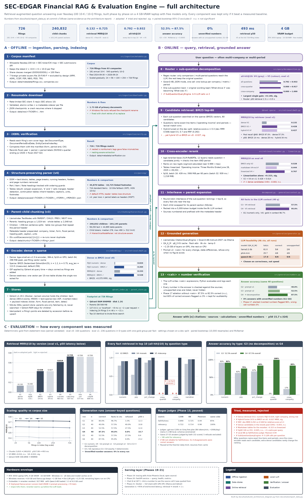
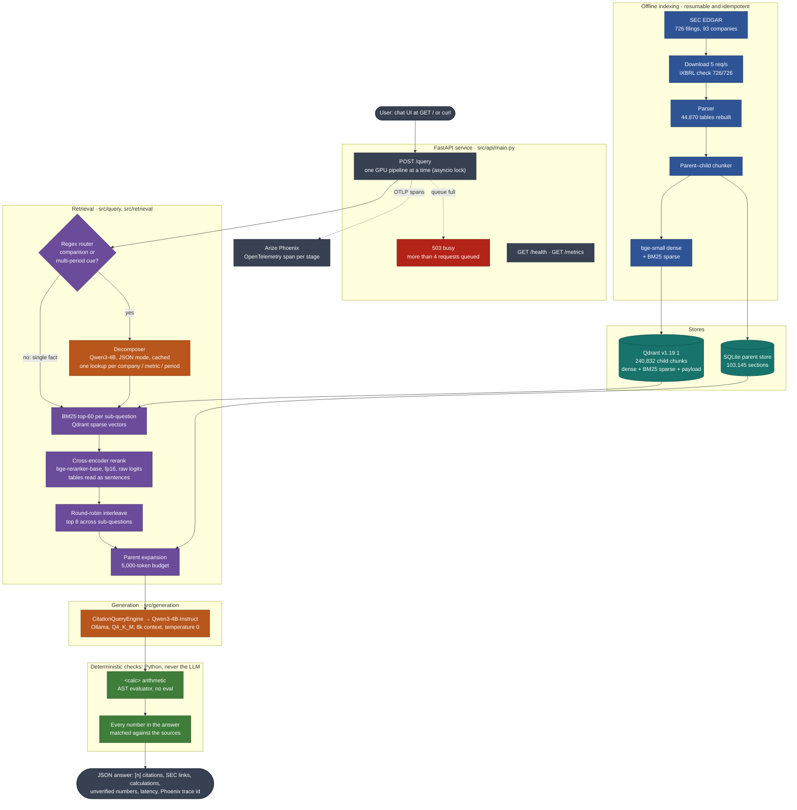
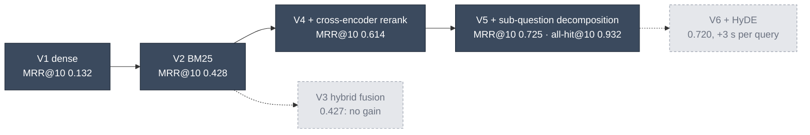

# SEC-EDGAR Financial RAG & Evaluation Engine

RAG over Nasdaq-100 10-K / 10-Q filings with hybrid retrieval (BM25 + dense in Qdrant),
BGE cross-encoder reranking, HyDE / sub-question decomposition, and Ragas evaluation.

## Architecture at a glance

[](docs/figures/architecture_overview.png)

Every pipeline stage with its measured numbers and the alternatives it was compared against.
The full write-up is [docs/SEC_EDGAR_RAG_Architecture_Report.docx](docs/SEC_EDGAR_RAG_Architecture_Report.docx).
Both are generated from the result files by `docs/tools/report_data.py`:

```powershell
.venv\Scripts\python docs\tools\build_architecture_diagram.py   # -> docs/figures/architecture_overview.png
.venv\Scripts\python docs\tools\build_report.py                 # -> docs/SEC_EDGAR_RAG_Architecture_Report.docx
```

## System architecture



In Docker (`docker compose --profile app up`) the same pipeline runs as four services on
127.0.0.1: `qdrant`, `phoenix`, `ollama` and `api`, with Ollama and the API on the GPU.

### How the retrieval pipeline was chosen

Each step was kept only if it beat the previous one on eval set v1 (236 questions with
deterministic answer keys; paired bootstrap, 95% CI). Dashed branches were measured and rejected.



With decomposition, answer accuracy on the same 40 questions went from 52.5% to 87.5%, and no
answer in any run contained a number that the sources don't support.

## Setup

```powershell
py -3.12 -m venv .venv
.venv\Scripts\python -m pip install -r requirements.txt
copy .env.example .env   # then set SEC_USER_AGENT="Name email@domain"
```

## Corpus pipeline

```powershell
# 1. Wikipedia Nasdaq-100 -> CIK -> latest 2x 10-K + 6x 10-Q per company
.venv\Scripts\python -m src.ingestion.metadata
#    -> data/metadata/companies.csv, data/metadata/filings.csv (the manifest)

# 2. Download primary documents (resumable; re-run to retry failures)
.venv\Scripts\python -m src.ingestion.downloader --tickers AAPL MSFT NVDA
.venv\Scripts\python -m src.ingestion.downloader            # full manifest
#    -> data/raw/<TICKER>/<filing_id>.htm + .json metadata sidecar

# 3. Check each file's iXBRL cover tags (form, period end, CIK) against the manifest
.venv\Scripts\python -m src.ingestion.verify
#    -> data/metadata/verification.csv (also records fiscal year / fiscal quarter)
```

## Parsing

```powershell
.venv\Scripts\python -m src.parsing.parser --tickers AAPL MSFT NVDA   # or no args for all
#    -> data/processed/<TICKER>/<filing_id>.json
```

Each filing becomes an ordered list of elements (`heading`, `paragraph`, `table`,
`footnote`) labelled with `part`, `item`, `section`, `note` and `subsection`.
Tables are rebuilt into clean markdown grids (currency/parenthesis cells merged,
period headers aligned, continuation tables inherit their headers) and carry a
caption, units and linked footnotes. Page headers/footers and the table of
contents are dropped. `stats.section_mode` is `titles` for the few filers that
don't use standard "Item N" headings (Intel, Honeywell 10-K); their section
labels are lower confidence.

## Chunking (LlamaIndex parent-child nodes)

```powershell
.venv\Scripts\python -m src.chunking.hierarchical      # settings in configs/chunking.yaml
#    -> data/chunks/<TICKER>/<filing_id>.jsonl  (LlamaIndex TextNodes, parents then children)
```

- **Parents** (LLM context): heading-delimited text groups (<=1024 tokens) and whole
  tables with caption, units and footnotes (<=2048 tokens, split with repeated headers).
- **Children** (retrieval units, ~256 tokens): sentence-split text, or table row
  groups that repeat the period header rows so every number keeps its column label.
- Each child's embedding text is prefixed with company, form, fiscal period, heading
  path, table caption and units; IDs are deterministic (`uuid5(accession/p/c)`).
- Full corpus: ~240k children, ~103k parents; every child <=512 tokens incl. metadata.

## Embeddings and Qdrant index

```powershell
# torch must come from the CUDA index first (see requirements.txt)
.venv\Scripts\python -m src.embeddings.embedder --tickers AAPL MSFT NVDA --smoke-test
#    -> data/embeddings/bge-small-en-v1.5/<TICKER>/<filing_id>.npz (cached vectors)

docker compose up -d                      # Qdrant v1.19.1, dashboard: http://127.0.0.1:6333/dashboard
.venv\Scripts\python -m src.retrieval.qdrant_index --tickers AAPL MSFT NVDA
#    -> Qdrant collection sec_filings_bge_small (children: dense vector + payload)
#    -> data/index/parents.sqlite (parents, fetched by id for context expansion)
```

- Collection has a named dense vector `text-dense` and a reserved sparse vector
  `text-sparse-new` (IDF modifier, for BM25) in LlamaIndex's naming, so
  `QdrantVectorStore` reads it directly; keyword/datetime payload indexes on ticker,
  form, fiscal year/period, section, content type, dates.
- Re-indexing is idempotent (points deleted by accession before upsert).
- Use `127.0.0.1`, not `localhost`: on Windows `localhost` tries IPv6 first and each
  request stalls ~2 s (indexing 24 filings: 3m46s -> 21s).

## Retrieval evaluation

```powershell
.venv\Scripts\python -m src.evaluation.dataset --tickers AAPL MSFT NVDA     # -> data/eval/retrieval_v0.jsonl
.venv\Scripts\python -m src.evaluation.retrieval --retriever dense --version V1
#    -> data/eval/results/experiments.csv (one row per experiment) + per-query CSV and traces
```

`retrieval_v0` (24 filings, 164 questions), ground truth is deterministic and auditable:
- **140 numeric** questions generated from primary-statement rows (current-period column only;
  the period text is validated against the filing's period end). Relevant = every child that
  contains that row with that value, or a text chunk stating the value with the line item.
- **24 narrative** questions from `configs/eval_narrative.yaml`, each with an explicit
  relevance rule (filing scope, heading, required keywords); 2-28 relevant chunks each.

| Version | Retrieval | Reranker | P@3 | R@5 | MRR@10 | Hit@10 | numeric P@3 | narrative P@3 | p50 latency |
|---|---|---|---|---|---|---|---|---|---|
| V1 | Dense (bge-small) | - | 0.089 | 0.106 | 0.153 | 0.244 | 0.024 | 0.472 | 30 ms |
| V2 | BM25 (Qdrant sparse) | - | 0.285 | 0.512 | 0.528 | 0.817 | 0.264 | 0.403 | 13 ms |
| V3 | Hybrid dense30 + BM25-30, relative fusion a=0.3 | - | 0.270 | 0.493 | 0.502 | 0.811 | 0.243 | 0.431 | 34 ms |
| V4-md | BM25 top-60 | bge-reranker-base, markdown tables | 0.238 | 0.485 | 0.444 | 0.805 | 0.190 | 0.514 | 479 ms |
| **V4** | BM25 top-60 | bge-reranker-base, linearized tables | **0.441** | **0.797** | **0.767** | **0.970** | **0.429** | **0.514** | 529 ms |
| V4h | BM25-45 + dense-15 | same as V4 | 0.441 | 0.786 | 0.764 | 0.957 | 0.426 | 0.528 | 490 ms |

P@3 ceiling on this set is 0.632 (most questions have 1-2 relevant chunks), so V4 reaches 70%
of the achievable maximum. Significance: paired bootstrap over questions
(`python -m src.evaluation.compare RUN_A RUN_B`, 95% CI):

- V1 -> V2 BM25: MRR +0.375 [+0.30, +0.45]; numeric-driven (dense is better on narrative, n.s.)
- V2 -> V3 hybrid: MRR -0.027 [-0.054, -0.000]; dense candidates add noise to numeric ranking
- V2 -> V4 reranker: MRR +0.239 [+0.17, +0.30], significant for numeric and narrative
- V4-md -> V4 linearization: MRR +0.323 [+0.26, +0.39]; numeric +0.379, narrative unchanged
- V4 vs V4h (adding dense candidates to the pool): -0.003 [-0.019, +0.014], a tie

Reranker notes: fp16 (0.55 GB VRAM), ranks on raw logits (the default sigmoid saturates at
0.999 and turns the top of the list into ties), and reads table chunks linearized as sentences
("Operating income: Three Months Ended June 28, 2025 = 28,202; ...") -- on markdown tables a
prose-trained cross-encoder prefers MD&A text *about* a metric over the row that *contains* it
(for 22 of 40 numeric questions the top-1 was such a text chunk).

V1 finding: for numeric questions the top-3 is always the right company and 48% the right
filing, but only 6% of those chunks contain the asked line item -- a table chunk's embedding
is dominated by its headers and numbers, so one row label is diluted. Exact-term matching
(BM25) and query-chunk cross-attention (reranker) target exactly this.

## Generation

```powershell
.venv\Scripts\python -m src.generation.generator "What was Apple's operating income in the third quarter of fiscal 2025?"
.venv\Scripts\python -m src.evaluation.generation --n 30        # end-to-end numeric accuracy
```

V4 retrieval -> parent expansion (5k-token budget; oversized tables fall back to the retrieved
row group) -> LlamaIndex `CitationQueryEngine` with numbered sources and the LLM metadata header
-> Qwen3-4B-Instruct-2507 (Ollama, q8_0 KV, 8k context) -> `<calc>` arithmetic evaluated in
Python (AST evaluator, no `eval`) -> every number in the answer verified against the sources.

G1 (30 numeric questions, stratified by company x statement):

| correct value | gold in context | correct given context | unverified numbers | refused | cited | p50 / p95 |
|---|---|---|---|---|---|---|
| 80.0% | 96.7% | 82.8% | **0%** | 3.3% (only when retrieval missed) | 96.7% | 12.3 s / 26.6 s |

Of the 6 misses, 3 are badly generated questions (cash-flow *change* rows phrased like
balance-sheet levels, e.g. "accounts payable for the year" -> model answered the balance), 1 is a
generator bug (group label carried past its "Total" row), 1 is ambiguous (current vs total
deferred revenue), 1 is a genuine wrong-column read. Fixed in the eval-set phase before
re-measuring.

Runtime notes: warm up the embedder + reranker *before* the LLM loads so Ollama sizes its GPU
layers around them; reranker batch 16 (60 pairs: 439 ms / 906 MiB vs 939 ms / 1218 MiB at 32);
`ollama_server.stop()` also kills orphaned `llama-server.exe` runners, which otherwise keep VRAM
and push the next run into shared-memory spill (prompt processing fell to ~70 tok/s).

## Evaluation set v1 (Phase 12)

`python -m src.evaluation.dataset --tickers AAPL MSFT NVDA` -> `data/eval/retrieval_v1.jsonl`, 236 questions:
140 numeric, 24 year-over-year, 15 % change, 24 cross-quarter (2 filings), 9 cross-company,
24 narrative. Facts come from primary-statement rows (current + prior-period column, periods
validated); multi-fact questions carry one gold group per fact. Fixes over v0: cash-flow
working-capital rows are phrased as "change in ...", groups end at their total/"Net cash" row,
current balance-sheet items are marked "(current)", % change only for positive levels.
v0 results are kept for history; v1 results live in `data/eval/results/retrieval_v1/`.

| Version | Retrieval | P@3 | R@5 | MRR@10 | Hit@10 | All-hit@10 | p50 |
|---|---|---|---|---|---|---|---|
| V1 | Dense | 0.071 | 0.104 | 0.132 | 0.233 | 0.225 | 28 ms |
| V2 | BM25 | 0.223 | 0.466 | 0.428 | 0.661 | 0.661 | 14 ms |
| V3 | Hybrid (relative, a=0.3) | 0.218 | 0.457 | 0.427 | 0.653 | 0.653 | 34 ms |
| V4 | BM25 top-60 -> BGE rerank (linearized) | 0.321 | 0.611 | 0.614 | 0.805 | 0.792 | 483 ms |
| **V5** | V4 + sub-question decomposition (router + Qwen JSON) | **0.422** | **0.711** | **0.725** | **0.941** | **0.932** | 507 ms |

All-hit@10 by question type (every required fact retrieved):

| Version | numeric | yoy | pct_change | cross_quarter | cross_company | narrative |
|---|---|---|---|---|---|---|
| V1 | 0.157 | 0.167 | 0.267 | 0.000 | 0.000 | 0.958 |
| V2 | 0.786 | 0.542 | 0.867 | 0.000 | 0.000 | 0.833 |
| V3 | 0.764 | 0.500 | 0.867 | 0.000 | 0.000 | 0.917 |
| V4 | 0.907 | 0.958 | 0.933 | 0.000 | 0.000 | 0.958 |
| **V5** | **0.907** | **1.000** | **1.000** | **0.917** | **1.000** | **0.958** |

Single-query retrieval cannot serve multi-fact questions: cross-quarter/cross-company all-hit@10
is 0.000 for every retriever. The gold labels are right -- asked alone, "What was Apple's net
income in fiscal 2025 Q3?" puts the gold row at rank 1, but the compound comparison question
pulls MD&A comparison tables instead. This is the measured case for sub-question decomposition.

Generation on a stratified 40-question sample (`python -m src.evaluation.generation --version G3`):

| Run | correct | correct given all facts in context | numeric | yoy | pct_change | cross_quarter | cross_company | wrong refusals | unverified numbers | p50 |
|---|---|---|---|---|---|---|---|---|---|---|
| G2 | 40.0% | 56.5% | 91.7% | 12.5% | 50.0% | 0.0% | 16.7% | 3 | 0% | 10.8 s |
| G3 | 52.5% | 78.3% | 91.7% | 62.5% | 66.7% | 0.0% | 16.7% | 0 | 0% | 12.4 s |
| **G4** (decomposition) | **87.5%** | 86.8% | 91.7% | 75.0% | 83.3% | 100.0% | 83.3% | 0 | 0% | 15.7 s |

G2 -> G3 is a prompt change only (same questions): every change/percentage must be a `<calc>`
(no self-rounding), comparisons must state the difference, and the refusal sentence may not be
appended to an answer. 5 answers fixed, 0 broken. Remaining misses are retrieval (multi-fact
questions never get both facts into context) and period ambiguity ("fiscal 2025" answered from
the Q3 10-Q's nine-month column instead of the 10-K).

## Sub-question decomposition (Phase 14)

`src/query/decomposition.py`: one Qwen3-4B call (Ollama JSON mode) splits a question into the
minimal list of self-contained lookups (one company, one metric, one explicit period each).
Few-shot examples use companies/metrics that are *not* in the eval set (Costco, Intel/AMD,
Tesla). A single returned sub-question falls back to the original wording (the LLM once turned
"What drove X's growth?" into "What was X?"). A regex router sends only questions with a
comparison / multi-period cue to the LLM -- on eval v1 it agreed with the LLM's own split
decisions on all 235 questions -- which brings median retrieval latency from 2.3 s back to 0.5 s.
`src/retrieval/decomposed.py` runs V4 per sub-question and interleaves the ranked lists
round-robin; the LLM then answers the *original* question from the merged context (2 LLM calls,
vs 4-5 for LlamaIndex's SubQuestionQueryEngine, and the model sees both facts together for
`<calc>`). Decompositions are cached so retrieval and generation runs use identical sub-questions.

- Retrieval V4 -> V5: all-hit@10 0.792 -> 0.932 (+0.140, 95% CI [+0.10, +0.19]); cross-company
  0.000 -> 1.000, cross-quarter 0.000 -> 0.917; numeric and narrative exactly unchanged.
- Generation G3 -> G4 (same 40 questions): 52.5% -> 87.5% correct; 15 fixed, 1 broken
  (McNemar p ~ 0.0005). The 5 remaining misses all had the facts in context: 2 wrong-row reads,
  1 period ambiguity ("fiscal 2025" answered from a 10-Q), 1 self-rounded % instead of `<calc>`,
  1 wrong value.

## Ragas (Phase 13): in progress, paused

Free judges only. `python -m src.evaluation.ragas_eval` scores faithfulness and answer relevancy
(ragas 0.4 collections) on the saved answers + exact contexts of G5 (no decomposition) and G6
(decomposition); refusals are not judged (no claims to verify). Judges live in
`configs/evaluation.yaml`, each with its own cache and result files:

- `groq-gpt-oss-120b` (Groq free plan): 27 G5 answers judged -- faithfulness 0.890, relevancy 0.722 --
  before the free ~200K tokens/day limit; the guard stopped cleanly and the run resumes from cache.
- `local-llama3.1-8b` (Ollama, schema-constrained decoding): validated on the same 27 answers.
  Relevancy agrees with the 120B judge (Pearson 0.98, 100% same side of 0.5); faithfulness does not
  (Pearson 0.44 -- it failed 3 answers the deterministic answer key shows are correct), so it is
  used for relevancy only. Remaining: relevancy on all 128 locally; 120B faithfulness mainly on the
  narrative answers (typed answers already have answer-key and number-verification checks).

## HyDE (Phase 15): evaluated, not adopted

`src/query/hyde.py`: LlamaIndex `HyDEQueryTransform` with the local Qwen writes a <=80-word
filing-style passage for the question (cached). The passage is embedded as a *passage* and averaged
with the question's *query* embedding (BGE is asymmetric; LlamaIndex's default would embed the
passage with the query instruction). It is used only for retrieval, never shown to the answering
LLM. Controls isolate HyDE from simply adding dense candidates to the rerank pool:

| Comparison (MRR@10, eval v1, 236 questions) | diff | 95% CI |
|---|---|---|
| V1 dense -> V1h HyDE-dense | +0.011 | [-0.011, +0.033] n.s. (narrative -0.026 n.s.) |
| V5h (decomp + BM25-45 + dense-15) -> V6 (same pool, HyDE dense) | 0.000 | [-0.006, +0.004] n.s. |
| V5 (best) -> V6 | -0.005 | [-0.017, +0.008] n.s. (numeric -0.009, significant) |

HyDE adds ~3 s per query (one local LLM call) and no measurable gain: once the cross-encoder
reranks a BM25 pool, dense candidates barely affect the final ranking (V4h, V5h and V6 all tie).
It stays implemented behind the `union_45_hyde15` pool, off by default.

## Scaling to 726 filings (Phase 16)

`python -m src.pipeline.scale` adds companies stage by stage (AAPL, MSFT, NVDA -- the eval
companies -- first, then by ticker; `data/eval/scaling_stages.json`), embeds and indexes only the
new filings, records the footprint and re-runs V2 / V4 / V5 on the unchanged eval v1 questions.
Every added filing is a potential distractor. Parser v4 / chunker v3 across all 726 filings
(240,832 children, max 490 tokens); BM25 `avg_len` kept at 113.5 (full corpus 114.8).

| Stage | Filings | Companies | Chunks | V2 MRR | V4 MRR | V5 MRR | V5 P@3 | V5 all-hit@10 | V5 p50 | Qdrant RAM | Qdrant disk | Parents DB | Embed / index |
|---|---|---|---|---|---|---|---|---|---|---|---|---|---|
| S24 | 24 | 3 | 5,810 | 0.428 | 0.614 | 0.725 | 0.422 | 0.932 | 538 ms | 308.6MiB | 88M | 13 MB | 27s / 5s |
| S50 | 56 | 7 | 13,950 | 0.424 | 0.608 | 0.722 | 0.419 | 0.932 | 524 ms | 381.9MiB | 104M | 31 MB | 71s / 43s |
| S100 | 104 | 13 | 36,207 | 0.406 | 0.605 | 0.722 | 0.422 | 0.924 | 520 ms | 451.6MiB | 227M | 76 MB | 101s / 55s |
| S250 | 254 | 32 | 85,890 | 0.403 | 0.602 | 0.721 | 0.412 | 0.924 | 509 ms | 486.3MiB | 564M | 182 MB | 183s / 131s |
| Sall | 726 | 93 | 240,832 | 0.406 | 0.592 | 0.715 | 0.411 | 0.907 | 493 ms | 898MiB | 1.2G | 508 MB | 518s / 366s |

V5 at 30x the corpus: MRR -0.010 (95% CI [-0.031, +0.009]), all-hit@10 -0.025 (n.s.) -- the full
pipeline holds. V4 without decomposition loses a little but significantly (MRR -0.022
[-0.042, -0.003], all-hit@10 -0.034): more BM25 distractors, which decomposition's narrower
sub-queries mostly avoid. Latency is flat (~0.5 s, dominated by reranking 60 candidates; BM25 search
14 -> 18 ms at 41x the chunks). Dense (V1) was not re-measured at scale: it is not part of V4/V5.

## Observability with Arize Phoenix (Phase 19)

```powershell
docker compose up -d                                   # qdrant + phoenix (UI: http://127.0.0.1:6006)
.venv\Scripts\python -m src.observability.latency_report --last 5    # per-stage latency from Phoenix spans
```

`src/observability/tracing.py` sets up the OpenTelemetry SDK with an OTLP/HTTP exporter to Phoenix
(project `sec-edgar-rag`) and OpenInference's LlamaIndex instrumentation, which traces the query
engine, retrievers, reranker postprocessor, parent expansion, synthesizer and every Ollama call.
Custom spans cover what LlamaIndex can't see: `query.decompose` (router decision, sub-questions,
cache/LLM source), `retrieve.candidate_pool`, `rerank.cross_encoder` and `answer.calc_and_verify`
(calculations, unverified numbers), with OpenInference span kinds. Without `setup_tracing()` the
no-op tracer is used, so evaluations pay nothing. Notes: `phoenix.otel.register()` 0.17.1 fails with
opentelemetry-exporter 1.45 (reads a removed private attribute), so the SDK is configured directly;
OTel's default 128-attribute cap silently dropped the retrieved documents OpenInference records, so
the span limit is 2048 with 4,000-character values; embedding vectors are hidden.

Latency breakdown read back from Phoenix (warm pipeline, V5 + Qwen3-4B):

| Question | total | decompose | BM25 pool | rerank | LLM | calc/verify | other |
|---|---|---|---|---|---|---|---|
| single fact (Apple operating income) | 18.7 s | 0 ms (router skip) | 51 ms | 489 ms | 17.7 s | 2 ms | 378 ms |
| comparison, 2 sub-questions | 26.0 s | 3 ms (cached) | 105 ms | 843 ms | 25.0 s | 1 ms | 56 ms |

Generation is ~95% of end-to-end latency; retrieval + reranking is under a second.

## FastAPI service (Phase 20)

```powershell
docker compose up -d
.venv\Scripts\python -m uvicorn src.api.main:app --host 127.0.0.1 --port 8000   # single worker: one GPU
curl -X POST http://127.0.0.1:8000/query -H "Content-Type: application/json" -d "{\"question\": \"...\"}"
```

- Chat UI at **http://127.0.0.1:8000/** (`src/api/static/chat.html`, one self-contained file, no build
  step or CDN): answers with clickable `[n]` citations, cited SEC filings with links, a "numbers match a
  source" / unverified-numbers badge, sub-questions, `<calc>` results, latency and the Phoenix trace id.
  History stays in the browser (localStorage); each question is answered independently. Interactive
  API docs at `/docs`.
- `POST /query` -> answer, sub-questions, cited sources (filing, period, section, SEC URL), `<calc>`
  calculations, unverified numbers, latency `{total, retrieval, generation}`, request id and the
  Phoenix `trace_id`. `GET /health` (503 until Qdrant, Ollama and the models are ready), `GET /metrics`
  (requests, errors, busy rejections, in-flight/queued, p50/p95, refusal and unverified-number rates).
- One GPU: pipeline runs are serialised by an asyncio lock in a worker thread, at most 4 requests may
  queue (then 503). Startup warms BM25 + reranker + embedder before Ollama loads the LLM (~67 s).
- Live check: `/health` answered in 73 ms and `/metrics` in 5 ms while a query was generating; two
  concurrent queries were queued and both completed; every response's trace id is in Phoenix.
- Known limitation seen live: period resolution. "Most recent annual report" and a bare "fiscal 2026"
  retrieved a 10-Q / older 10-K (one refusal, one year-to-date figure instead of the annual one). Needs
  a query-understanding step that maps a fiscal year without a quarter to the 10-K and "latest" to each
  company's newest filing via metadata filters.

## Docker (Phase 21)

```powershell
docker compose up -d                          # infrastructure only (Qdrant + Phoenix) for native work
docker compose --profile app up -d --build    # full stack: + Ollama + API, both on the GPU
curl http://127.0.0.1:8000/health
```

- Four services: `qdrant` (v1.19.1, named volume), `phoenix` (named volume), `ollama` (0.34.4, same
  env as native: flash attention, q8_0 KV, 8k context, one slot) and `api` (`docker/Dockerfile`,
  `python:3.12-slim` + CUDA torch 2.14 cu126, 11.7 GB). Ports bind to 127.0.0.1 only.
- Nothing is copied into the image but `src/` and `configs/`. Models (`./models`), the parent store
  (`./data/index`) and the decomposition cache are bind-mounted from D:, and the container runs with
  `HF_HUB_OFFLINE=1`, so it never downloads anything. Ollama reuses `models/ollama` (no re-pull).
- Service addresses come from env overrides in `load_config` (`QDRANT_URL`, `OLLAMA_HOST`,
  `PHOENIX_COLLECTOR_ENDPOINT`), so the same YAML works natively (127.0.0.1) and in compose.
- Fixes needed for the container: the parent store opens read-only + immutable (SQLite WAL locking is
  unreliable on a Windows bind mount; `checkpoint()` folds the WAL in after indexing), and BM25 loads
  its cached snapshot directly when offline, because fastembed's `files_metadata.json` was written on
  Windows with backslash paths and its offline check always fails on Linux.
- Live check (Apple operating income fiscal 2025 Q3 -> $28,202M, same as native; traces in Phoenix):

| | native (Phase 19) | Docker, warm |
|---|---|---|
| single fact: total / LLM | 18.7 s / 17.7 s | 3.9 s / 3.3 s |
| comparison, 2 sub-questions: total / LLM | 26.0 s / 25.0 s | 11.8 s / 10.6 s |
| cold start until `/health` 200 | ~67 s | 192 s (models read over the bind mount) |

  Same model, quantisation, context and KV cache; in the container Ollama keeps 73% of Qwen on the GPU.
  The native run's answer was also longer (it added the prior-year figure), so this is not a controlled
  speed comparison, but the container is at least no slower.
- The stack keeps Qwen loaded (`LLM_KEEP_ALIVE=24h`; natively 10m): after Ollama unloaded an idle model
  the next question took 63 s instead of 4 s.
- llama-server (inside Ollama 0.34) keeps a host-RAM prompt cache, 8 GiB by default, saving every
  request's KV state (0.1-0.4 GB). RAG prompts never repeat, so after ~18 questions the runner reached
  5.6 GB, the Docker VM (7.6 GB) swapped (generation fell to 0.16 tok/s) and the OOM killer ended it.
  `LLAMA_ARG_CACHE_RAM=0` (compose and the native launcher) disables it; memory now stays flat.
- Seen while picking the chat examples: "Microsoft's total revenue in fiscal 2025" is refused because
  BM25 on "revenue" filled the context with *Unearned revenue* notes, not the income statement.
- The comparison question "Apple's revenue in Q3 2024 and Q3 2025" was answered with fiscal 2025 Q3
  and fiscal 2026 Q3 figures: the same period-resolution limitation (calendar vs fiscal year). Both
  numbers exist in the context, so number verification passes; wrong-period numbers are Phase 17's scope.

## Local LLM feasibility (4 GB VRAM)

```powershell
# Ollama portable v0.34.4 unzipped to tools\ollama (not the C: installer); models in models\ollama
.venv\Scripts\python -m src.generation.llm_feasibility --pull
.venv\Scripts\python -m src.generation.llm_feasibility             # 3 models x 3 contexts x 2 KV types
.venv\Scripts\python -m src.generation.llm_feasibility --coresident qwen3-4b --context 8192
```

One real RAG prompt (Apple FY2025 Q3 parents; answer: operating income $28,202M vs $25,352M).
All candidates are Q4_K_M, flash attention on, one parallel slot.

| model (Q4_K_M) | on GPU | gen tok/s 4k / 8k (q8 KV) | co-resident 8k* | right values | wrong numbers |
|---|---|---|---|---|---|
| Qwen3-4B-Instruct-2507 | ~2.25 of 3.1-3.4 GB | 17.0 / 7.3 | 8.2 tok/s, 21 s | 6/6 | 0/6 |
| Llama-3.2-3B-Instruct | 2.2 GB (fully at 4k) | 61.0 / 31.4 | 32.0 tok/s, 15 s | 5/6 | 2/6 |
| Phi-4-mini-instruct | ~2.25 of 3.2-3.5 GB | 25.7 / 13.1 | - | 4/6 | 4/6 |

\* embedder + bge-reranker-base (fp16, 927 MiB) loaded first, as in the live API; total GPU 3.3/4.0 GB.
Windows reserves ~0.8 GB of the GPU and llama.cpp keeps ~1 GB free, so every model gets ~2.25 GB of
VRAM and spills the rest to CPU; an 8-bit KV cache cuts memory and speeds up every configuration.
This is feasibility only: quality is decided on the evaluation set in the generation phase.

Filing IDs are `<TICKER>_<FORM>_<period_of_report>`, e.g. `AAPL_10Q_2025-06-28`.
Foreign private issuers (ARM, ASML, PDD, ...) file 20-F/40-F and are excluded by design.

## Tests

```powershell
.venv\Scripts\python -m pytest -q
```

## License

The code is released under the [MIT License](LICENSE). It covers this repository's code and
documentation only:

- SEC EDGAR filings are public data from the U.S. Securities and Exchange Commission. The filings
  themselves are downloaded at run time (see the SEC's fair-access policy for request limits); only
  short excerpts appear here, as retrieved contexts in the evaluation files.
- Models are downloaded separately and keep their own licenses: bge-small-en-v1.5 and
  bge-reranker-base (MIT), Qwen3-4B-Instruct-2507 (Apache 2.0), Llama 3.1 8B (Llama 3.1 Community License).
