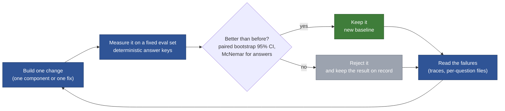
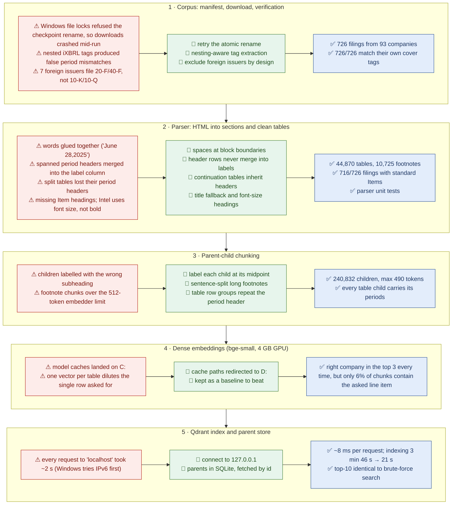
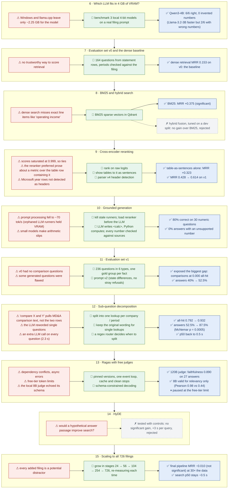
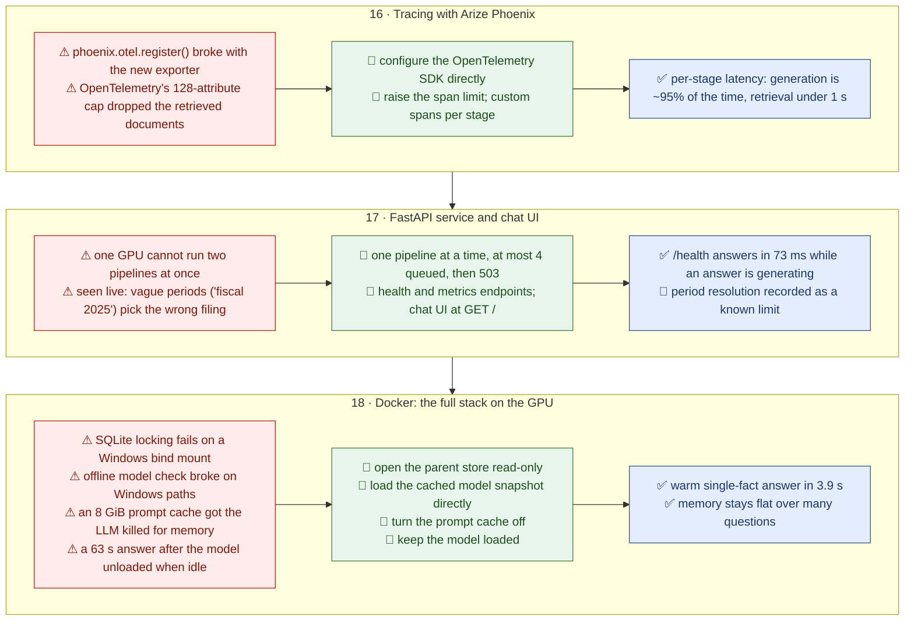
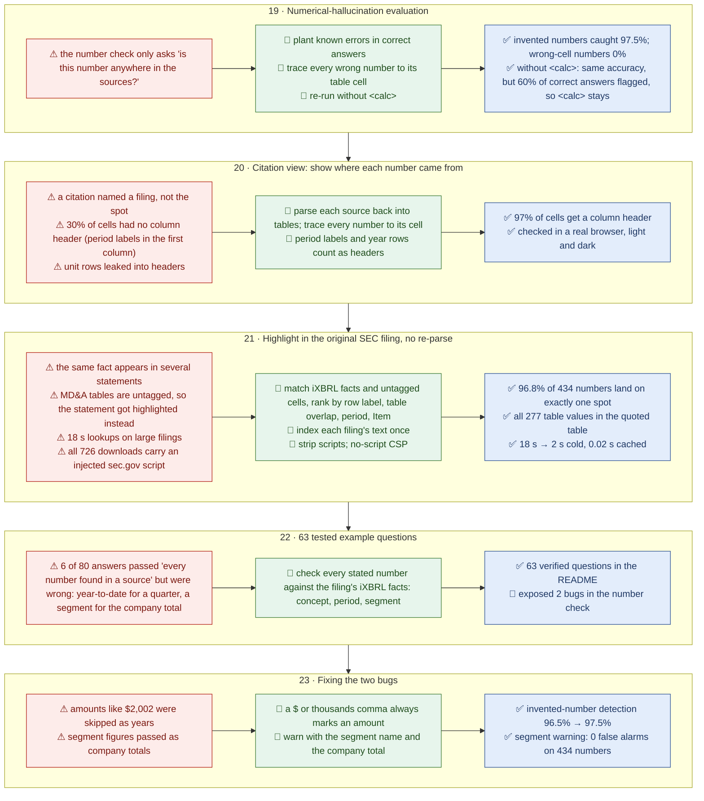

# How this project was built

A step-by-step record from the first download to the finished chat UI. For each step: what was
built, what went wrong, how it was fixed, and the measurement that decided whether the fix stayed.
Numbers come from the [architecture report](SEC_EDGAR_RAG_Architecture_Report.docx) and the README.

## The loop behind every step

Every component had to beat the version before it on a fixed evaluation set before it was kept.

**How to read the diagrams below:** each step is one row, from left to right:

| Box | Meaning |
|---|---|
| **⚠ red** | the problem that came up |
| **🔧 green** | the fix |
| **✅ blue** | the test or measurement that confirmed it |
| **✗ grey** | an idea that was measured and rejected |

Steps are numbered in the order they happened.

## Part 1: from SEC EDGAR to a searchable index

## Part 2: finding what actually works

Retrieval quality on eval set v1 is MRR@10 (the rank of the first right result); all-hit@10 means
every fact a question needs is in the top 10.

## Part 3: shipping it as a service

## Part 4: proving the numbers

## Still open

- **Ragas:** paused at 32 judged answers because of free-tier limits. It resumes from cache.
- **Vector quantization (Phase 18):** not run yet.
- **Period-aware number check:** compare the period and filing of each quoted cell with the period
  the question asks for. This is the gap step 19 measured, and the most common cause of the remaining
  wrong answers.
- **Small percentages:** whole percentages up to 31% are still skipped by the day-of-month rule.
